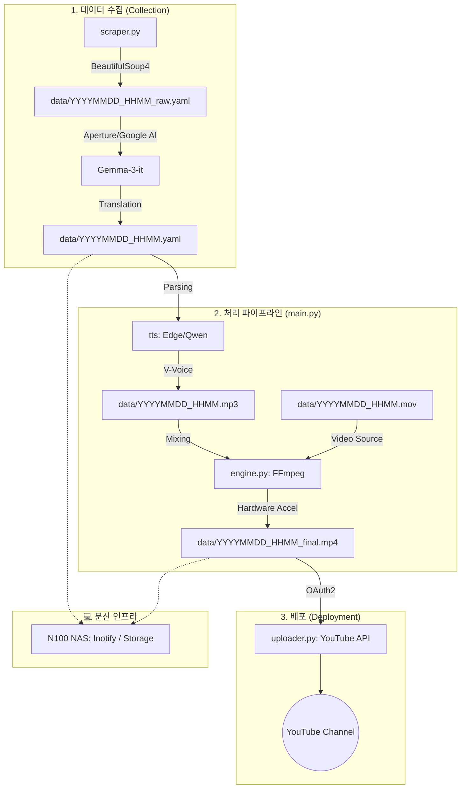

# 오늘의 베트남 뉴스 (today-vn-news)

베트남 뉴스 자동화 파이프라인 입니다. [📺유튜브에서 확인하세요](https://www.youtube.com/playlist?list=PLzMxB6D1eypIA_JNasD_MNISMEUtMbHvK)

1. 수집.
2. 번역.
3. TTS.
4. FFmpeg.
5. Youtube.
6. Archive.
7. 알림.

## 🏗️ 서비스 아키텍처


```mermaid
graph TD
    subgraph "1. 데이터 수집 (Collection)"
        S[scraper.py] -->|BeautifulSoup4| RAW[data/YYYYMMDD_HHMM_raw.yaml]
        RAW -->|Aperture/Google AI| G[Gemma-3-it]
        G -->|Translation| YAML[data/YYYYMMDD_HHMM.yaml]
    end

    subgraph "2. 처리 파이프라인 (main.py)"
        YAML -->|Parsing| TTS[tts: Edge/Qwen]
        TTS -->|V-Voice| MP3[data/YYYYMMDD_HHMM.mp3]

        MP3 -->|Mixing| Engine[engine.py: FFmpeg]
        MOV[data/YYYYMMDD_HHMM.mov] -->|Video Source| Engine

        Engine -->|Hardware Accel| Final[data/YYYYMMDD_HHMM_final.mp4]
    end

    subgraph "3. 배포 (Deployment)"
        Final -->|OAuth2| UP[uploader.py: YouTube API]
        UP --> YT((YouTube Channel))
    end

    subgraph "💻 분산 인프라"
        NAS[N100 NAS: Inotify / Storage]
    end

    YAML -.-> NAS
    Final -.-> NAS
```

## 🎯 데이터 소스

| 소스 | 분류 | 수집 방식 |
|:---|:---|:---|
| **NCHMF** | 기상 | 스크래핑 |
| **IQAir + Open-Meteo** | 공기질 | API (AQI, PM2.5, PM10) |
| **IGP-VAST** | 지진 | RSS 피드 |
| **Nhân Dân** | 정부 기관지 | 스크래핑 |
| **Sức khỏe & Đời sống** | 보건부 공식 | 스크래핑 |
| **Tuổi Trẻ / VietnamNet / VnExpress** | 종합 뉴스 | 스크래핑 / RSS |
| **Thanh Niên** | 사회/청년 | RSS 파싱 |
| **The Saigon Times** | 경제 | 스크래핑 |
| **VietnamNet 정보통신** | IT/통신 | 스크래핑 |
| **VnExpress IT/과학** | IT/과학 | 스크래핑 |

```

## 📂 프로젝트 구조

```
today-vn-news/
├── main.py                # 엔트리포인트
├── pyproject.toml         # 프로젝트 설정
├── .env.example           # 환경 변수 예시
├── today_vn_news/         # Core 패키지
│   ├── scraper.py         # 뉴스 스크래핑
│   ├── translator.py      # 베트남어 → 한국어 번역
│   ├── tts/               # TTS 패키지
│   │   ├── __init__.py    # 통합 인터페이스
│   │   ├── edge.py        # Edge TTS (클라우드)
│   │   └── qwen.py        # Qwen3-TTS (로컬)
│   ├── engine.py          # FFmpeg 영상 합성
│   └── uploader.py        # 유튜브 업로드
├── tests/                 # pytest 테스트
│   ├── conftest.py        # 공통 fixture
│   ├── unit/              # 단위 테스트
│   │   ├── test_scraper.py
│   │   ├── test_translator.py
│   │   ├── test_tts.py
│   │   ├── test_engine.py
│   │   └── test_uploader.py
│   └── integration/       # 통합 테스트
│       └── test_pipeline.py
├── data/                  # YAML/MP3/MP4 출력
└── assets/                # 배경 이미지 등
```

## 🚀 시작하기

```bash
# 1. 환경 설정
cp .env.example .env

# 2. 의존성 설치
uv sync

# 3. 실행
uv run python main.py              # 현재 시간, Edge TTS 사용 (기본)
uv run python main.py 20260210     # 특정 날짜, Edge TTS 사용 (기본)
uv run python main.py --tts=qwen   # Qwen3-TTS 사용
uv run python main.py --help       # 사용법 안내
```

## ⚖️ 라이선스

MIT License - Copyright (c) 2026 Crong
