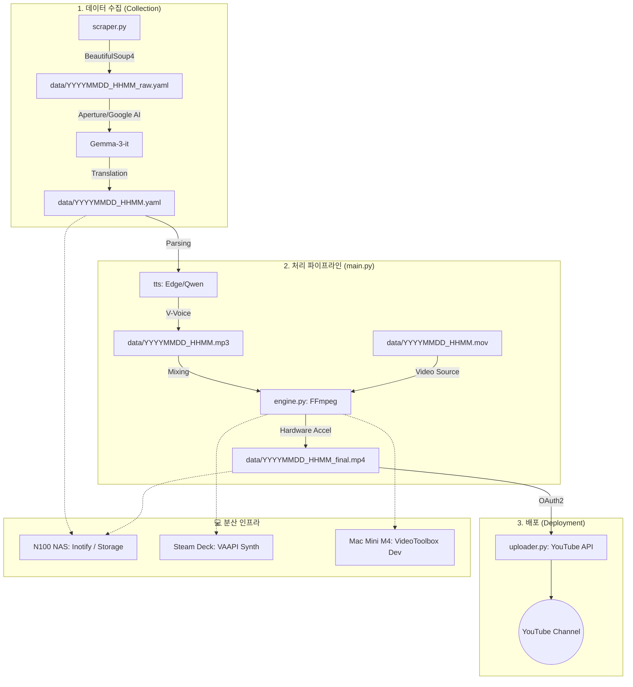

# 오늘의 베트남 뉴스 (today-vn-news)

> **AI** 를 활용해 생성된 프로젝트입니다.

베트남 뉴스 자동화 파이프라인. BeautifulSoup4 스크래핑 + **Tailscale AI Gateway**(Gemma-3) 번역 + TTS(Edge/Qwen) 음성 생성 + FFmpeg 영상 합성 + YouTube 업로드.

## 📺 생성된 콘텐츠

이 프로젝트로 생성된 뉴스 영상들을 유튜브에서 확인하세요:

[👉 유튜브 플레이리스트](https://www.youtube.com/playlist?list=PLzMxB6D1eypIA_JNasD_MNISMEUtMbHvK)

## 🏗️ 서비스 아키텍처


```mermaid
graph TD
    subgraph "1. 데이터 수집 (Collection)"
        S[scraper.py] -->|BeautifulSoup4| RAW[data/YYYYMMDD_HHMM_raw.yaml]
        RAW -->|Aperture/Google AI| G[Gemma-3-it]
        G -->|Translation| YAML[data/YYYYMMDD_HHMM.yaml]
    end

    subgraph "2. 처리 파이프라인 (main.py)"
        YAML -->|Parsing| TTS[tts: Edge/Qwen]
        TTS -->|V-Voice| MP3[data/YYYYMMDD_HHMM.mp3]

        MP3 -->|Mixing| Engine[engine.py: FFmpeg]
        MOV[data/YYYYMMDD_HHMM.mov] -->|Video Source| Engine

        Engine -->|Hardware Accel| Final[data/YYYYMMDD_HHMM_final.mp4]
    end

    subgraph "3. 배포 (Deployment)"
        Final -->|OAuth2| UP[uploader.py: YouTube API]
        UP --> YT((YouTube Channel))
    end

    subgraph "💻 분산 인프라"
        NAS[N100 NAS: Inotify / Storage]
        SD[Steam Deck: VAAPI Synth]
        MAC[Mac Mini M4: VideoToolbox Dev]
    end

    YAML -.-> NAS
    Final -.-> NAS
    Engine -.-> SD
    Engine -.-> MAC
```

## 🎯 데이터 소스

| 소스 | 분류 | 수집 방식 |
|:---|:---|:---|
| **NCHMF** | 기상 | 스크래핑 |
| **IQAir + Open-Meteo** | 공기질 | API (AQI, PM2.5, PM10) |
| **IGP-VAST** | 지진 | RSS 피드 |
| **Nhân Dân** | 정부 기관지 | 스크래핑 |
| **Sức khỏe & Đời sống** | 보건부 공식 | 스크래핑 |
| **Tuổi Trẻ / VietnamNet / VnExpress** | 종합 뉴스 | 스크래핑 / RSS |
| **Thanh Niên** | 사회/청년 | RSS 파싱 |
| **The Saigon Times** | 경제 | 스크래핑 |
| **VietnamNet 정보통신** | IT/통신 | 스크래핑 |
| **VnExpress IT/과학** | IT/과학 | 스크래핑 |

## 📂 프로젝트 구조

```
today-vn-news/
├── main.py                # 엔트리포인트
├── pyproject.toml         # 프로젝트 설정
├── .env.example           # 환경 변수 예시
├── today_vn_news/         # Core 패키지
│   ├── scraper.py         # 뉴스 스크래핑
│   ├── translator.py      # 베트남어 → 한국어 번역
│   ├── tts/               # TTS 패키지
│   │   ├── __init__.py    # 통합 인터페이스
│   │   ├── edge.py        # Edge TTS (클라우드)
│   │   └── qwen.py        # Qwen3-TTS (로컬)
│   ├── engine.py          # FFmpeg 영상 합성
│   └── uploader.py        # 유튜브 업로드
├── tests/                 # pytest 테스트
│   ├── conftest.py        # 공통 fixture
│   ├── unit/              # 단위 테스트
│   │   ├── test_scraper.py
│   │   ├── test_translator.py
│   │   ├── test_tts.py
│   │   ├── test_engine.py
│   │   └── test_uploader.py
│   └── integration/       # 통합 테스트
│       └── test_pipeline.py
├── data/                  # YAML/MP3/MP4 출력
└── assets/                # 배경 이미지 등
```

## 🚀 시작하기

```bash
# 1. 환경 설정
cp .env.example .env
# .env 파일에 API 키 설정: GEMINI_API_KEY, IQAIR_API_KEY
# TTS 엔진 선택: TTS_ENGINE=edge (기본) 또는 TTS_ENGINE=qwen

# Aperture AI Gateway 사용 시 (Tailscale 필요)
# APERTURE_BASE_URL=http://ai
# APERTURE_MODEL=gemma-3-12b-it

# 2. 의존성 설치
uv sync

# Qwen3-TTS 사용 시 추가 의존성 설치 (선택)
uv sync --extra qwen

# 3. 실행
uv run python main.py              # 현재 시간, Edge TTS 사용 (기본)
uv run python main.py 20260210     # 특정 날짜, Edge TTS 사용 (기본)
uv run python main.py --tts=qwen   # Qwen3-TTS 사용
uv run python main.py --help       # 사용법 안내
```

### 번역 백엔드 선택

번역은 **Tailscale AI Gateway** (Aperture) 또는 **Google AI Studio** 중 선택하여 사용할 수 있습니다.

| 백엔드 | 방식 | 장점 | 단점 |
|--------|------|------|------|
| **Aperture** (기본) | Tailscale 네트워크 | 무료, 로컬 네트워크, 빠른 응답 | Tailscale 설정 필요 |
| **Google AI Studio** | 클라우드 API | 별도 설정 없음 | API 키 필요, 요금 발생 가능 |

#### Tailscale AI Gateway 설정

Tailscale 네트워크에 연결된 Aperture 서버가 있는 경우:

```bash
# .env 파일에 추가
APERTURE_BASE_URL=http://ai              # 또는 https://ai.your-tailnet.ts.net
APERTURE_MODEL=gemma-3-12b-it            # 기본 모델
```

#### Google AI Studio Fallback

`APERTURE_BASE_URL`이 설정되지 않으면 자동으로 Google AI Studio를 사용:

```bash
# .env 파일에 추가
GEMINI_API_KEY=your-api-key-here
GEMINI_MODEL=gemma-3-27b-it              # 기본 모델
```

### TTS 엔진 선택

| 엔진 | 방식 | 장점 | 단점 | 음성 |
|------|------|------|------|------|
| **edge** (기본) | 클라우드 API | 빠름, 고품질 | 인터넷 필요, API 호출 | ko-KR-SunHiNeural 등 |
| **qwen** | 로컬 실행 | 오프라인, 무료, VoiceDesign | GPU 권장, 첫 실행 다운로드 (3-5GB) | Sohee, Vivian, Serena 등 9 개 |

#### Mac M4 에서 실행 시 주의사항

- **MPS 백엔드 자동 사용**: `device_map="mps"`
- **발열**: 장시간 실행 시 열스로틀링 발생 가능
- **성능**: GPU 에 비해 느림 (실시간 생성 권장 안함)
- **권장**: 클라우드 GPU 또는 DashScope API 사용

```bash
# 환경 변수로 설정
export TTS_ENGINE=qwen
uv run python main.py

# 또는 명령줄 인자로 직접 지정
uv run python main.py --tts=qwen --voice=Sohee

# VoiceDesign (음성 스타일 지정)
uv run python main.py --tts=qwen --voice=Sohee --instruct="따뜻한 아나운서 음성"
```

### 🎤 Qwen3-TTS 사용 가능한 음성 목록

Qwen3-TTS CustomVoice 모델 (0.6B) 은 **9 개의 프리미엄 음성**을 제공합니다.

> 💡 **모델:** `Qwen/Qwen3-TTS-12Hz-0.6B-CustomVoice` (기본값)
> - 메모리 사용량: 약 2-3GB (1.7B 대비 60% 감소)
> - Mac M4 에서 최적화된 경량 모델

#### 공식 음성 (9 개)

| 음성명 | 언어 | 성별 | 설명 |
|--------|------|------|------|
| `Sohee` | ko | female | Warm Korean female voice with rich emotion |
| `Ryan` | en | male | Dynamic male voice with strong rhythmic drive |
| `Aiden` | en | male | Sunny American male voice with a clear midrange |
| `Ono_Anna` | ja | female | Playful Japanese female voice with a light, nimble timbre |
| `Vivian` | zh | female | Bright, slightly edgy young female voice |
| `Serena` | zh | female | Warm, gentle young female voice |
| `Uncle_Fu` | zh | male | Seasoned male voice with a low, mellow timbre |
| `Dylan` | zh | male | Youthful Beijing male voice with a clear, natural timbre |
| `Eric` | zh | male | Lively Chengdu male voice with a slightly husky brightness |

**지원 언어:** 한국어, 영어, 일본어, 중국어, 독일어, 프랑스어, 러시아어, 포르투갈어, 스페인어, 이탈리아어

#### CustomVoice 기능

`instruct` 파라미터로 음성 스타일을 자연어로 설명할 수 있습니다:

```bash
# 한국어
python main.py --tts=qwen --voice=Sohee --instruct="따뜻한 아나운서 음성으로 읽어주세요"

# 영어
python main.py --tts=qwen --voice=Aiden --language=English --instruct="Speak in a cheerful tone"

# 일본어
python main.py --tts=qwen --voice=Ono_Anna --language=Japanese --instruct="明るく元気な声で読んでください"
```

> 💡 **출처:** [Qwen3-TTS GitHub](https://github.com/QwenLM/Qwen3-TTS)

#### 음성 목록 확인 명령

```bash
# 전체 음성 목록 출력
python tests/unit/test_qwen_voices.py --list-voices

# 특정 언어만 출력 (ko, en, ja, zh 등)
python tests/unit/test_qwen_voices.py --list-voices --lang ko

# 특정 음성 테스트
python tests/unit/test_qwen_voices.py --voice Sohee

# 모든 음성 일괄 테스트
python tests/unit/test_qwen_voices.py --all
```

## 🧪 테스트

### 전체 테스트

```bash
uv run pytest                      # 전체 테스트
uv run pytest -m "not slow"        # 빠른 테스트 (API 호출 제외)
uv run pytest --cov=today_vn_news  # 커버리지 포함
```

### 단계별 부분 테스트

파이프라인 단계별로 개별 테스트 실행:

```bash
# 1. 스크래핑 테스트 (데이터 수집)
uv run pytest tests/unit/test_scraper.py -v

# 2. 번역 테스트 (Gemma API)
uv run pytest tests/unit/test_translator.py -v

# 3. TTS 테스트 (Edge TTS)
uv run pytest tests/unit/test_tts.py -v

# Qwen3-TTS 테스트 (로컬 실행, GPU 권장)
uv run pytest tests/unit/test_tts.py::TestTTSQwenLocal -v

# 4. 영상 합성 테스트 (FFmpeg)
uv run pytest tests/unit/test_engine.py -v

# 5. YouTube 업로드 테스트
uv run pytest tests/unit/test_uploader.py -v
```

### 특정 테스트만 실행

```bash
# 특정 함수 테스트
uv run pytest tests/unit/test_scraper.py::TestScraperNCHMF::test_scrape_weather_hochiminh_real_api -v

# 키워드로 필터링
uv run pytest -k "weather" -v

# 마커로 필터링
uv run pytest -m "not slow" -v    # slow 테스트 제외
uv run pytest -m upload -v        # 업로드 테스트만
uv run pytest -m "not upload" -v  # 업로드 제외
```

## ⚖️ 라이선스

MIT License - Copyright (c) 2026 Crong
