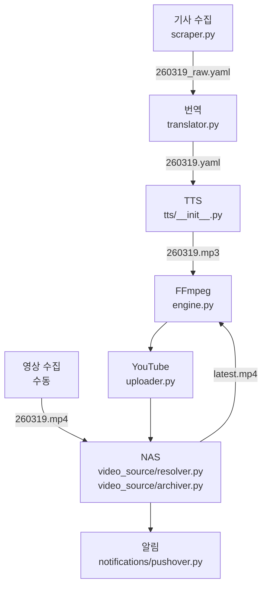

# 오늘의 베트남 뉴스 (today-vn-news)

베트남 뉴스 자동화 파이프라인 입니다. [📺유튜브에서 확인하세요](https://www.youtube.com/playlist?list=PLzMxB6D1eypIA_JNasD_MNISMEUtMbHvK)


## 🏗️ 서비스 아키텍처


```mermaid
graph TD
    SCRAPE[기사 수집<br/>scraper.py] -->|260319_raw.yaml| TRANSLATE[번역<br/>translator.py]
    TRANSLATE -->|260319.yaml| TTS[TTS<br/>tts/__init__.py]
    TTS -->|260319.mp3| FFMPEG[FFmpeg<br/>engine.py]

    VIDEO[영상 수집<br/>수동] -->|260319.mp4| NAS[NAS<br/>video_source/resolver.py<br/>video_source/archiver.py]
    NAS -->|latest.mp4| FFMPEG

    FFMPEG --> YOUTUBE[YouTube<br/>uploader.py]
    YOUTUBE --> NAS
    NAS --> ALERT[알림<br/>notifications/pushover.py]
```

## 🎯 데이터 소스

| 소스 | 분류 | 수집 방식 |
|:---|:---|:---|
| **NCHMF** | 기상 | 스크래핑 |
| **IQAir + Open-Meteo** | 공기질 | API (AQI, PM2.5, PM10) |
| **IGP-VAST** | 지진 | RSS 피드 |
| **Nhân Dân** | 정부 기관지 | 스크래핑 |
| **Sức khỏe & Đời sống** | 보건부 공식 | 스크래핑 |
| **Tuổi Trẻ / VietnamNet / VnExpress** | 종합 뉴스 | 스크래핑 / RSS |
| **Thanh Niên** | 사회/청년 | RSS 파싱 |
| **The Saigon Times** | 경제 | 스크래핑 |
| **VietnamNet 정보통신** | IT/통신 | 스크래핑 |
| **VnExpress IT/과학** | IT/과학 | 스크래핑 |

## 📂 프로젝트 구조

```
today-vn-news/
├── main.py                            # 엔트리포인트
├── pyproject.toml                     # 프로젝트 설정
├── .env.example                       # 환경 변수 예시
├── today_vn_news/                     # Core 패키지
│   ├── scraper.py                     # 뉴스 스크래핑
│   ├── translator.py                  # 베트남어 → 한국어 번역
│   ├── tts/                            # TTS 패키지
│   │   ├── __init__.py                 # 통합 인터페이스
│   │   ├── edge.py                     # Edge TTS (클라우드 API)
│   │   └── qwen.py                     # Qwen3-TTS (로컬 LLM)
│   ├── engine.py                       # FFmpeg 영상 합성
│   ├── uploader.py                     # 유튜브 업로드
│   ├── video_source/                   # 영상 소스 패키지
│   │   ├── __init__.py
│   │   ├── resolver.py                  # 영상 소스 해결 (우선순위)
│   │   └── archiver.py                  # NAS 아카이빙
│   ├── config/                         # 설정 패키지
│   │   ├── __init__.py
│   │   └── video_config.py              # 비디오 설정
│   ├── notifications/                  # 알림 패키지
│   │   ├── __init__.py
│   │   ├── pipeline_status.py           # 파이프라인 상태 추적
│   │   └── pushover.py                  # Pushover 알림
│   ├── exceptions.py                    # 커스텀 예외
│   ├── logger.py                       # 로깅 설정
│   └── retry.py                        # 재시도 처리
├── tests/                              # pytest 테스트
│   ├── conftest.py                     # 공통 fixture
│   ├── unit/                           # 단위 테스트
│   │   ├── test_scraper.py
│   │   ├── test_translator.py
│   │   ├── test_tts.py
│   │   ├── test_engine.py
│   │   └── test_uploader.py
│   ├── test_notifications/             # 알림 단위 테스트
│   │   ├── test_pipeline_status.py
│   │   └── test_pushover.py
│   └── integration/                    # 통합 테스트
│       └── test_pipeline.py
├── data/                               # YAML/MP3/MP4 출력
└── assets/                             # 배경 이미지 등
```

## 🚀 시작하기

```bash
# 1. 환경 설정
cp .env.example .env

# 2. 의존성 설치
uv sync

# 3. 실행
uv run python main.py              # 현재 시간, Edge TTS 사용 (기본)
uv run python main.py 260210       # 특정 날짜, Edge TTS 사용 (기본)
uv run python main.py --tts=qwen   # Qwen3-TTS 사용
uv run python main.py --help       # 사용법 안내
```

## 수집

베트남 뉴스 기사와 DJI 영상 수집
- NCHMF, IQAir, 정부 기관지 등 다양한 소스에서 스크래핑
- DJI Osmo Nano로 촬영한 로컬 영상 사용

## 번역

Gemma-3-it으로 베트남어 → 한국어 번역
- Tailscale Aperture (AI Gateway) 경유
- 병렬 처리로 빠른 번역 속도

## TTS

Edge TTS 또는 Qwen3-TTS로 음성 변환
- Edge TTS: 클라우드 API 방식 (Microsoft, 인터넷 연결 필요)
- Qwen3-TTS: 로컬 LLM 방식 (오프라인스, 로컬에서 직접 실행, 처리 시간 약 20분, 실패 가능성 있음)

## FFmpeg

FFmpeg로 음성과 영상 결합
- TTS MP3와 NAS 영상 믹스
- 배경 이미지 또는 로컬 영상 사용

## YouTube

유튜브에 영상 업로드
- YouTube Data API v3 사용
- 플레이리스트 자동 추가

## 아카이빙

N100 NAS에 미디어 보관
- 최종 영상과 TTS 음성 파일 저장

## 알림

PushOver로 푸시 알림 발송 (iOS, Android, Desktop)
- 파이프라인 상태별 우선순위 부여

## ⚖️ 라이선스

MIT License - Copyright (c) 2026 Crong