# 🇻🇳 오늘의 베트남 뉴스 (today-vn-news)

Vibe Coding 기반 뉴스 자동화 파이프라인.

## 📋 프로젝트 개요

베트남 현지 10개 소스(안전/정부/보건/종합/IT/정보통신/사회/경제) 뉴스 수집(YAML) 및 분산 인프라 기반 영상 제작 자동화 시스템. 사용자 건강(UC) 및 전문 분야(IT) 중심 큐레이션 제공.

## 🏗️ 분산 아키텍처 (Distributed Infrastructure)

| 기기 | OS | 주요 역할 | 가속 기술 |
| :--- | :--- | :--- | :--- |
| **N100 NAS** | Fedora | 데이터 저장소, 파일 업로드 감시 | - |
| **Steam Deck** | SteamOS | 24/7 배치 서버, TTS 음성 생성, 영상 합성 | **VAAPI** |
| **Mac Mini M4** | macOS | 로직 개발, 고해상도 최종 렌더링 가속 | **VideoToolbox** |

## 🔄 시스템 아키텍처 및 데이터 흐름

```mermaid
graph TD
    subgraph "1. 데이터 수집 (Collection)"
        S[scraper.py] -->|BeautifulSoup4| RAW[data/YYYYMMDD_HHMM_raw.yaml]
        RAW -->|Gemini API| G[Gemma-3-27b-it]
        G -->|Translation| YAML[data/YYYYMMDD_HHMM.yaml]
    end

    subgraph "2. 처리 파이프라인 (main.py)"
        YAML -->|Parsing| TTS[tts.py: edge-tts]
        TTS -->|V-Voice| MP3[data/YYYYMMDD_HHMM.mp3]
        
        MP3 -->|Mixing| Engine[engine.py: FFmpeg]
        MOV[data/YYYYMMDD_HHMM.mov] -->|Video Source| Engine
        
        Engine -->|Hardware Accel| Final[data/YYYYMMDD_HHMM_final.mp4]
    end

    subgraph "3. 배포 (Deployment)"
        Final -->|OAuth2| UP[uploader.py: YouTube API]
        UP --> YT((YouTube Channel))
    end

    subgraph "💻 분산 인프라"
        NAS[N100 NAS: Inotify / Storage]
        SD[Steam Deck: VAAPI Synth]
        MAC[Mac Mini M4: VideoToolbox Dev]
    end

    MD -.-> NAS
    Final -.-> NAS
    Engine -.-> SD
    Engine -.-> MAC
```



## 🎯 콘텐츠 큐레이션 우선순위

1. **건강 및 안전:** 궤양성 대장염 식단, 호치민 대기질 및 알레르기(오리풀).
2. **IT/정보통신:** 베트남 AI 렌더링, AWS 클라우드, 5G 통신망.
3. **로컬 뉴스:** 호치민 시정 및 주요 로컬 이벤트.

## 📂 리포지토리 구조

```text
today-vn-news/
├── README.md           # 프로젝트 가이드
├── ContextFile.md      # 도메인 지식 및 기술 제약 (AI용 SSoT)
├── .clinerules         # AI 협업 지침 및 운영 정책
├── ROADMAP.md          # 장기 로드맵 (Step 1~5)
├── pyproject.toml      # uv 기반 프로젝트 설정 및 의존성
├── main.py             # 파이프라인 통합 실행 엔트리포인트
├── today_vn_news/      # Core 로직 패키지
│   ├── scraper.py      # BeautifulSoup4 기반 웹 스크래핑
│   ├── translator.py    # Gemma-3-27b 기반 베트남어→한국어 번역
│   ├── tts.py          # edge-tts 기반 음성 변환 (YAML Parsing)
│   ├── engine.py       # FFmpeg 기반 영상 합성 엔진
│   └── uploader.py     # YouTube Data API v3 업로드 모듈
├── client_secrets.json # (Secret) Google OAuth2 자격 증명 [Git Ignored]
└── .env                # (Secret) API 키 환경 변수 [Git Ignored]
```

## 🚀 시작하기 (Quick Start)

### 1. 환경 설정

`client_secrets.json` (유튜브 API) 및 `.env` (Gemini API 키) 파일을 프로젝트 루트에 준비합니다.

### 2. 의존성 설치

```bash
uv sync
```

### 3. 전체 파이프라인 실행

```bash
# 당일 뉴스 처리 (수집 -> TTS -> 합성 -> 업로드)
uv run main.py

# 특정 날짜 데이터 재생성 (날짜 포맷: YYYYMMDD_HHMM)
uv run main.py 20260112
```

### 📺 실행 결과 예시 (Success Scenario)

성공적으로 실행될 경우 다음과 같은 파이프라인 흐름을 거칩니다:

 ```text
 ========================================
 🇻🇳 오늘의 베트남 뉴스 (today-vn-news)
 ========================================

 [*] 모든 소스 스크래핑 시작 (2026-01-12)
 --------------------------------------------------
 [스크래핑] NCHMF 기상 정보 수집 중...
   [DEBUG] NCHMF 페이지 구조 분석 중...
   [INFO] 기상 정보 추가됨: 맑음, 32°C
   [OK] NCHMF 기상 정보 수집 완료
 [스크래핑] IQAir 공기질 정보 수집 중...
   [INFO] 공기질 정보 추가됨: AQI 85, 양호
   [OK] IQAir 공기질 정보 수집 완료
 [스크래핑] IGP-VAST 지진 정보 수집 중...
   [OK] IGP-VAST: 0개 지진 정보 수집
 [스크래핑] Nhân Dân 수집 중...
   [OK] Nhân Dân: 0개 기사 수집
 [스크래핑] Sức khỏe & Đời sống 수집 중...
   [OK] Sức khỏe & Đời sống: 0개 기사 수집
 [스크래핑] Tuổi Trẻ 수집 중...
   [OK] Tuổi Trẻ: 0개 기사 수집
 [스크래핑] VietnamNet 종합 뉴스 수집 중...
   [OK] VietnamNet 종합 뉴스: 2개 기사 수집
 [스크래핑] VnExpress 수집 중...
   [OK] VnExpress: 2개 기사 수집
 [스크래핑] Thanh Niên 수집 중...
   [OK] Thanh Niên: 2개 기사 수집
 [스크래핑] The Saigon Times 수집 중...
   [OK] The Saigon Times: 2개 기사 수집
 --------------------------------------------------
 [+] 원본 YAML 저장 완료: data/20260112_1353_raw.yaml

 [*] 모든 뉴스 번역 시작...
 --------------------------------------------------
   [OK] 안전 및 기상 관제 데이터 저장 완료: 2개
   [번역] VietnamNet 종합 뉴스 기사 2개 번역 중...
   [OK] VietnamNet 종합 뉴스 번역 완료: 2개
   [번역] VnExpress 기사 2개 번역 중...
   [OK] VnExpress 번역 완료: 2개
   [번역] Thanh Niên 기사 2개 번역 중...
   [OK] Thanh Niên 번역 완료: 2개
   [번역] The Saigon Times 기사 2개 번역 중...
   [OK] The Saigon Times 번역 완료: 2개
   [번역] VietnamNet 정보통신 기사 2개 번역 중...
   [OK] VietnamNet 정보통신 번역 완료: 2개
   [번역] VnExpress IT/과학 기사 2개 번역 중...
   [OK] VnExpress IT/과학 번역 완료: 2개
 --------------------------------------------------
 [+] 번역된 YAML 저장 완료: data/20260112_1353.yaml

 [*] 3단계: TTS 음성 변환 시작...
 [*] YAML 파일 읽기 및 정제 시작: data/20260112_1353.yaml
 [*] TTS 변환 시작 (Voice: ko-KR-SunHiNeural)...
 [+] 음성 파일 생성 완료: data/20260112_1353.mp3

 [*] 4단계: 영상 합성(FFmpeg) 시작...
 [+] 최종 영상 생성 완료: data/20260112_1353_final.mp4

 [*] 5단계: 유튜브 업로드 시작...
 [+] 업로드 완료! Video ID: mgt8WtaVxB8
 [*] 재생 목록에 추가 중... [OK]

 🎉 모든 파이프라인 작업이 성공적으로 완료되었습니다!
 ========================================
 ```

## 📊 주요 기능 완료 현황 (v0.7.0)

- [x] **Step 1: Collection** - BeautifulSoup4 기반 스크래핑 + Gemma-3-27b 번역
- [x] **Step 2: Voice & Optimization** - YAML 파싱 기반 TTS 음성 최적화
- [x] **Step 3: Video** - FFmpeg 하드웨어 가속(VideoToolbox/VAAPI) 합성 최적화
- [x] **Step 4: Deployment** - 유튜브 API 통합 및 보안 강화
- [ ] **Step 5: Operations** - NAS Inotify 감시 및 자동 스케줄링 진행 예정

## 📖 문서 시스템 및 협업 가이드

프로젝트의 지속 가능성과 AI 협업 효율을 위해 다음과 같은 문서 체계를 운용합니다.

### 문서 관계도


### 주요 문서 역할 (핵심 설정 파일 보호 정책)

아래 **1, 2, 3번 파일**은 프로젝트의 근간이 되는 설정으로, AI가 수정을 제안할 수 있으나 **반드시 사용자의 명시적 승인 후**에만 변경할 수 있습니다.

1. **.clinerules (AI 운영 매뉴얼)**: AI의 작업 방식, Git 정책 및 Vibe Coding 철학 정의. **(수정 시 사용자 승인 필수)**
2. **ContextFile.md (비즈니스 SSoT)**: 도메인 지식 및 기술 스펙의 단일 진실 공급원. **(수정 시 사용자 승인 필수)**
3. **ROADMAP.md (장기 로드맵)**: 파이프라인 단계별 마일스톤 관리. **(수정 시 사용자 승인 필수)**

## 🛠️ 핵심 최적화 지침

- **Zero-Noise:** 뉴스 리포트 내 AI의 메타 정보(진행 멘트 등) 자동 제거 로직 적용.
- **SOP 순서 준수:** `ContextFile.md`에 명시된 주요 섹션 순서대로 수집 및 정렬.
- **Hardware Accel:** 기기별(Mac/Steam Deck) 최적화된 하드웨어 인코더 자동 선택.

## ⚖️ 라이선스

MIT License - Copyright (c) 2026 Crong

## 🧪 테스트

### 실행 방법

```bash
# 전체 테스트 실행 (모든 실제 API 사용)
uv run pytest

# 빠른 테스트 (외부 API 제외)
uv run pytest -m "not slow"

# 업로드 테스트 제외
uv run pytest -m "not upload"

# 단위 테스트만
uv run pytest tests/unit/

# 통합 테스트만
uv run pytest tests/integration/

# 커버리지 확인
uv run pytest --cov=today_vn_news --cov-report=html
```

### 테스트 구조

```
tests/
├── conftest.py              # 공통 fixture 정의
├── fixtures/                # 테스트 데이터 샘플
│   ├── sample_news.json      # 뉴스 데이터 샘플
│   └── sample_translated.yaml # 번역된 YAML 샘플
├── unit/                    # 단위 테스트
│   ├── test_scraper.py      # 스크래핑 테스트
│   ├── test_translator.py   # 번역 테스트
│   ├── test_tts.py          # TTS 테스트
│   ├── test_engine.py       # FFmpeg 엔진 테스트
│   └── test_uploader.py    # 업로더 테스트
└── integration/             # 통합 테스트
    └── test_pipeline.py     # 전체 파이프라인 테스트
```

### 테스트 마커

- `unit`: 단위 테스트
- `integration`: 통합 테스트
- `slow`: 외부 API 호출 테스트
- `upload`: 유튜브 업로드 테스트

### 주의사항

- 모든 테스트는 실제 API를 사용합니다
- YouTube 업로드 테스트는 실제 영상을 업로드합니다
- `pytest -m "not slow"`로 빠르게 테스트 가능

