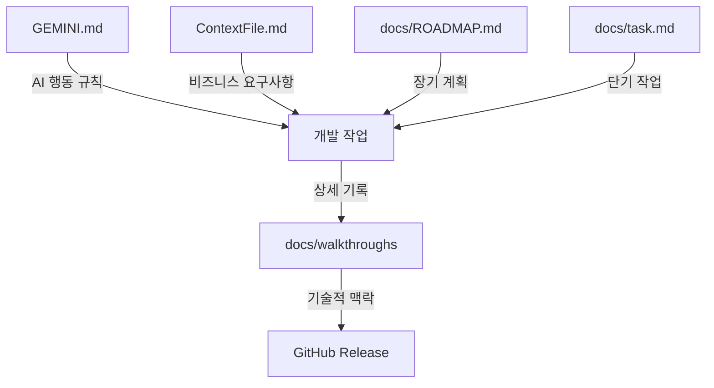

# 🇻🇳 오늘의 베트남 뉴스 (today-vn-news)

Vibe Coding 기반 뉴스 자동화 파이프라인.

## 📋 프로젝트 개요

베트남 현지 7대 일간지 뉴스 수집(MD) 및 분산 인프라 기반 영상 제작 자동화 시스템. 사용자 건강(UC) 및 전문 분야(IT) 중심 큐레이션 제공.

## 🏗️ 분산 아키텍처 (Distributed Infrastructure)

| 기기 | OS | 주요 역할 | 가속 기술 |
| :--- | :--- | :--- | :--- |
| **N100 NAS** | Fedora | 데이터 저장소, 파일 업로드 감시 | - |
| **Steam Deck** | SteamOS | 24/7 배치 서버, TTS 음성 생성, 영상 합성 | **VAAPI** |
| **Mac Mini M4** | macOS | 로직 개발, 고해상도 최종 렌더링 가속 | **VideoToolbox** |

## 🔄 시스템 아키텍처 및 데이터 흐름


## 🎯 콘텐츠 큐레이션 우선순위

1. **건강 및 안전:** 궤양성 대장염 식단, 호치민 대기질 및 알레르기(오리풀).
2. **IT 및 경제:** 베트남 Java/Spring 시장 동향, AWS 클라우드.
3. **로컬 뉴스:** 호치민 시정 및 주요 로컬 이벤트.

## 📂 리포지토리 구조

```text
today-vn-news/
├── README.md           # 프로젝트 가이드
├── ContextFile.md      # 도메인 지식 및 기술 제약 (AI용 SSoT)
├── GEMINI.md           # AI 협업 지침 및 운영 정책
├── docs/               # 문서 보관소
│   ├── ROADMAP.md      # 장기 로드맵 (Step 1~5)
│   ├── task.md         # 단기 작업 관리 (AI 전용)
│   └── walkthroughs/   # 주요 버전별 상세 구현 기록
├── main.py             # 파이프라인 통합 실행 엔트리포인트
├── today_vn_news/      # Core 로직 패키지
│   ├── collector.py    # Gemini API 기반 뉴스 수집 모듈
│   ├── tts.py          # edge-tts 기반 음성 변환 모듈
│   ├── engine.py       # FFmpeg 기반 영상 합성 엔진
│   └── uploader.py     # YouTube Data API v3 업로드 모듈
├── client_secrets.json # (Secret) Google OAuth2 자격 증명 [Git Ignored]
├── .env                # (Secret) API 키 환경 변수 [Git Ignored]
└── requirements.txt    # 의존성 패키지 관리
```

## � 시작하기 (Quick Start)

### 1. 환경 설정

`client_secrets.json` (유튜브 API) 및 `.env` (Gemini API 키) 파일을 프로젝트 루트에 준비합니다.

### 2. 의존성 설치

```bash
pip install -r requirements.txt
```

### 3. 전체 파이프라인 실행

```bash
# 당일 뉴스 처리 (수집 -> TTS -> 합성 -> 업로드)
python main.py

# 특정 날짜 뉴스 처리
python main.py 260106
```

## 📊 주요 기능 완료 현황 (v0.5.0)

- [x] **Step 1: Collection** - Gemini API 직접 호출 기반 수집 엔진 완성 (v0.5.0)
- [x] **Step 2: Voice & Optimization** - TTS 최적화(에모지 제거, 독음 변환) 및 마크다운 계층화 반영
- [x] **Step 3: Video** - FFmpeg 하드웨어 가속(VideoToolbox/VAAPI) 합성 최적화 완료
- [x] **Step 4: Deployment** - 유튜브 API 통합 및 보안 강화 (v0.4.0)
- [ ] **Step 5: Operations** - NAS Inotify 감시 및 자동 스케줄링 진행 예정

## �📖 문서 시스템 및 협업 가이드

프로젝트의 지속 가능성과 AI 협업 효율을 위해 다음과 같은 문서 체계를 운용합니다.

### 문서 관계도



### 주요 문서 역할 (핵심 설정 파일 보호 정책)

아래 **1, 2, 3번 파일**은 프로젝트의 근간이 되는 설정으로, AI가 수정을 제안할 수 있으나 **반드시 사용자의 명시적 승인 후**에만 변경할 수 있습니다.

1.  **GEMINI.md (AI 운영 매뉴얼)**: AI의 작업 방식, Git 정책 및 Vibe Coding 철학 정의. **(수정 시 사용자 승인 필수)**
2.  **ContextFile.md (비즈니스 SSoT)**: 도메인 지식 및 기술 스펙의 단일 진실 공급원. **(수정 시 사용자 승인 필수)**
3.  **docs/ROADMAP.md (장기 로드맵)**: 파이프라인 단계별 마일스톤 관리. **(수정 시 사용자 승인 필수)**
4.  **docs/task.md (단기 작업)**: 현재 세션의 세부 체크리스트 (AI 자동 관리).
5.  **docs/walkthroughs (구현 상세)**: 주요 마이너 버전(`v0.x.0`)의 기술적 맥락 및 검증 결과. (CHANGELOG 대체)

## 🛠️ 핵심 최적화 지침

- **Zero-Noise:** 뉴스 리포트 내 AI의 메타 정보(진행 멘트 등) 자동 제거 로직 적용.
- **SOP 순서 준수:** `ContextFile.md`에 명시된 주요 섹션 순서대로 수집 및 정렬.
- **Hardware Accel:** 기기별(Mac/Steam Deck) 최적화된 하드웨어 인코더 자동 선택.

## ⚖️ 라이선스

MIT License - Copyright (c) 2026 Crong (deuxksy)
