# 🇻🇳 오늘의 베트남 뉴스 (today-vn-news)

베트남 뉴스 자동화 파이프라인. BeautifulSoup4 스크래핑 + Gemma-3-27b 번역 + edge-tts 음성 생성 + FFmpeg 영상 합성 + YouTube 업로드.

## 🔄 데이터 파이프라인

```mermaid
flowchart LR
    A[데이터 소스<br/>10개 뉴스 사이트] --> B[스크래핑<br/>BeautifulSoup4]
    B --> C[YAML 저장<br/>raw]

    C --> D[번역<br/>Gemma-3-27b-it]
    D --> E[YAML 저장<br/>번역 완료]

    E --> F[TTS<br/>edge-tts]
    F --> G[MP3 저장]

    G --> H[영상 합성<br/>FFmpeg]
    H --> I[MP4 저장]

    I --> J[유튜브 업로드<br/>YouTube API]

    style A fill:#e1f5fe
    style D fill:#fff3e0
    style F fill:#f3e5f5
    style H fill:#e8f5e9
    style J fill:#ffebee
```



1. **스크래핑** - BeautifulSoup4 기반 10개 소스 수집
2. **번역** - Gemma-3-27b-it 기반 베트남어 → 한국어
3. **TTS** - edge-tts 기반 한국어 음성 변환
4. **영상 합성** - FFmpeg 하드웨어 가속
5. **유튜브 업로드** - YouTube Data API v3

## 🎯 데이터 소스

| 소스 | 분류 | 수집 방식 |
|:---|:---|:---|
| **NCHMF** | 기상 | 스크래핑 |
| **IQAir + Open-Meteo** | 공기질 | API (AQI, PM2.5, PM10) |
| **IGP-VAST** | 지진 | RSS 피드 |
| **Nhân Dân** | 정부 기관지 | 스크래핑 |
| **Sức khỏe & Đời sống** | 보건부 공식 | 스크래핑 |
| **Tuổi Trẻ / VietnamNet / VnExpress** | 종합 뉴스 | 스크래핑 / RSS |
| **Thanh Niên** | 사회/청년 | RSS 파싱 |
| **The Saigon Times** | 경제 | 스크래핑 |
| **VietnamNet 정보통신** | IT/통신 | 스크래핑 |
| **VnExpress IT/과학** | IT/과학 | 스크래핑 |

## 📂 프로젝트 구조

```
today-vn-news/
├── main.py                # 엔트리포인트
├── pyproject.toml         # 프로젝트 설정
├── .env.example           # 환경 변수 예시
├── today_vn_news/         # Core 패키지
│   ├── scraper.py         # 뉴스 스크래핑
│   ├── translator.py      # 베트남어 → 한국어 번역
│   ├── tts.py             # 음성 변환
│   ├── engine.py          # FFmpeg 영상 합성
│   └── uploader.py        # 유튜브 업로드
├── tests/                 # pytest 테스트
│   ├── conftest.py        # 공통 fixture
│   ├── unit/              # 단위 테스트
│   │   ├── test_scraper.py
│   │   ├── test_translator.py
│   │   ├── test_tts.py
│   │   ├── test_engine.py
│   │   └── test_uploader.py
│   └── integration/       # 통합 테스트
│       └── test_pipeline.py
├── data/                  # YAML/MP3/MP4 출력
└── assets/                # 배경 이미지 등
```

## 🚀 시작하기

```bash
# 1. 환경 설정
cp .env.example .env
# .env 파일에 API 키 설정: GEMINI_API_KEY, IQAIR_API_KEY

# 2. 의존성 설치
uv sync

# 3. 실행
uv run python main.py              # 현재 시간
uv run python main.py 20260210     # 특정 날짜
```

## 🧪 테스트

```bash
uv run pytest                      # 전체 테스트
uv run pytest -m "not slow"        # 빠른 테스트
uv run pytest --cov=today_vn_news  # 커버리지
```

## ⚖️ 라이선스

MIT License - Copyright (c) 2026 Crong
