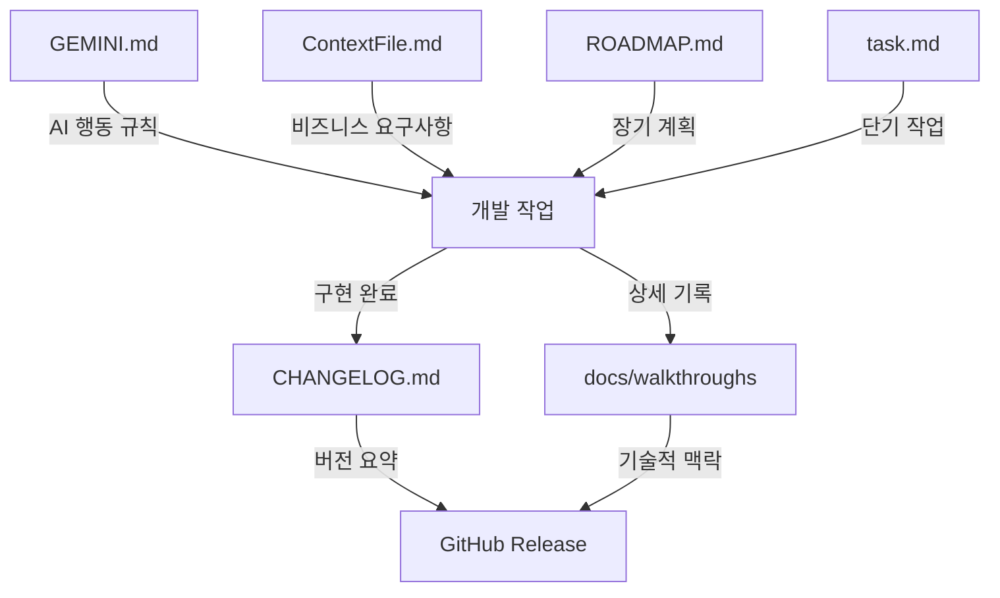

# Documentation Architecture

프로젝트의 문서 시스템 구조 및 역할 정의

## 문서 관계도



## 문서 목록

### 1. GEMINI.md (AI 운영 매뉴얼)
- **역할**: AI의 작업 방식 및 프로젝트 정책
- **갱신**: 정책 변경 시 (드물게)

### 2. ContextFile.md (비즈니스 SSoT)
- **역할**: 도메인 지식 및 기술 스펙의 단일 진실 공급원
- **갱신**: 비즈니스 로직 변경 시 (사용자 승인 필요!)

### 3. ROADMAP.md (장기 로드맵)
- **역할**: 5단계 파이프라인의 전체 마일스톤
- **갱신**: 분기별 또는 주요 방향 전환 시

### 4. task.md (AI 관리 - 단기 작업)
- **역할**: 현재 진행 중인 작업의 체크리스트
- **갱신**: 모든 작업 세션마다 (AI 자동 관리)
- **포맷**: `[ ]` 미완료 / `[/]` 진행중 / `[x]` 완료

### 5. CHANGELOG.md (과거 히스토리)
- **역할**: 버전별 변경사항의 공식 기록
- **갱신**: 모든 커밋마다 (필수!)

### 6. docs/walkthroughs (구현 상세)
- **역할**: 주요 릴리즈(0.x.0)의 기술적 맥락 보관
- **갱신**: Minor 버전 릴리즈마다

---

## 실전 활용 예시

**시나리오**: 새로운 기능 "베트남어 TTS 추가"

1. **ROADMAP.md**: `[ ] 다국어 음성 확장` 항목 확인
2. **task.md**: AI가 세부 작업 생성
   ```markdown
   - [ ] 베트남어 TTS 구현
       - [ ] vi-VN-HoaiMyNeural 모델 테스트
       - [ ] 언어 감지 로직 추가
       - [ ] 믹싱 검증
   ```
3. **구현 후**:
   - `task.md`: 모든 항목 `[x]` 체크
   - `CHANGELOG.md`: `## [0.6.0] - Added: 베트남어 TTS 지원`
   - `docs/walkthroughs/v0.6.0_vietnamese_tts.md`: 구현 상세 기록

---

## 문서 우선순위

### 🚫 절대 수정 금지 (사용자 승인 필요)
- **ContextFile.md**

### 📝 자동 관리 (AI)
- **task.md** (세션마다)
- **CHANGELOG.md** (커밋마다)

### 👤 사용자 관리
- **GEMINI.md** (정책 변경 시)
- **ROADMAP.md** (분기별)
- **docs/walkthroughs** (릴리즈마다)
