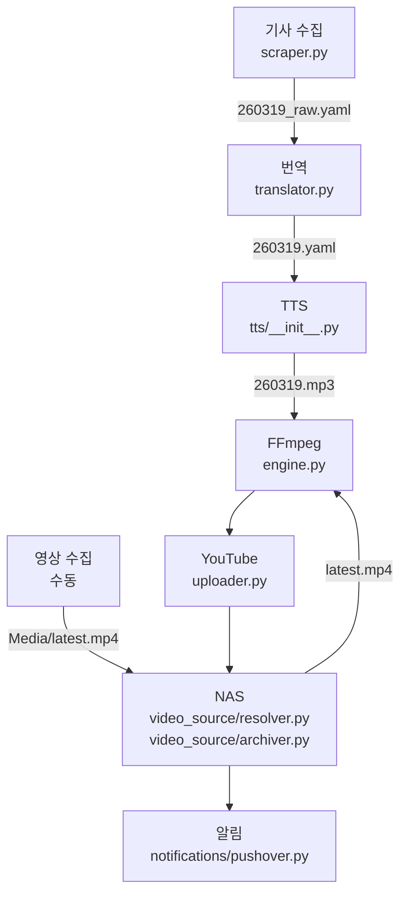

# 파일명 단순화 및 단계별 건너뛰기 구현 계획

> **For agentic workers:** REQUIRED SUB-SKILL: Use superpowers:subagent-driven-development (recommended) or superpowers:executing-plans to implement this plan task-by-task. Steps use checkbox (`- [ ]`) syntax for tracking.

**Goal:** 베트남 뉴스 파이프라인의 파일명 체계를 `YYYYMMDD_hhmm`에서 `YYMMDD`로 단순화하고, 각 단계 완료 시 `.done` 파일을 생성하여 파이프라인 중단 후 재실행 시 완료된 단계를 건너뛰도록 구현합니다.

**Architecture:**
- 타임스탬프 유틸리티 모듈(`timestamp.py`) 신규 생성으로 파일명 처리 중앙화
- `.done` 파일 기반 상태 추적으로 데이터베이스 없는 단순한 접근
- 선행 단계 누락 시 안전한 재시작 메커니즘

**Tech Stack:** Python 3, pathlib, pytest, 기존 FFmpeg 파이프라인

---

## 파일 구조

### 신규 생성
- `today_vn_news/timestamp.py` - 타임스탬프 정규화, 완료 파일 관리 유틸리티
- `tests/unit/test_timestamp.py` - 타임스탬프 유틸리티 단위 테스트

### 수정
- `today_vn_news/exceptions.py` - `PipelineRestartError` 예외 추가
- `main.py` - 타임스탬프 파싱, 건너뛰기 로직 적용
- `video_source/resolver.py` - YYMMDD 추출 로직 수정 (`base_name[:6]` → `base_name`)
- `today_vn_news/notifications/pipeline_status.py` - 단계명 상수 확인 (이미 존재, 검증만)

---

## Task 1: PipelineRestartError 예외 추가

**Files:**
- Modify: `today_vn_news/exceptions.py`

- [ ] **Step 1: 기존 예외 파일 끝에 PipelineRestartError 추가**

```python
# today_vn_news/exceptions.py (파일 끝, 168행 이후)

class PipelineRestartError(TodayVnNewsError):
    """
    파이프라인 재시작 필요 예외.

    선행 단계의 완료 파일(.done)이 누락되었을 때 발생.
    모든 데이터 파일을 삭제하고 처음부터 다시 실행해야 합니다.

    Attributes:
        message: 예외 메시지

    Example:
        >>> raise PipelineRestartError("선행 단계(scraper)가 완료되지 않았습니다.")
    """
    pass
```

- [ ] **Step 2: 예외 정의 테스트 작성**

```python
# tests/unit/test_exceptions.py (기존 파일에 추가)

def test_pipeline_restart_error():
    """PipelineRestartError 인스턴스화 테스트"""
    with pytest.raises(PipelineRestartError) as exc_info:
        raise PipelineRestartError("테스트 메시지")

    assert isinstance(exc_info.value, TodayVnNewsError)
    assert "테스트 메시지" in str(exc_info.value)
```

- [ ] **Step 3: 테스트 실행**

```bash
pytest tests/unit/test_exceptions.py::test_pipeline_restart_error -v
```

Expected: PASS

- [ ] **Step 4: 커밋**

```bash
git add today_vn_news/exceptions.py tests/unit/test_exceptions.py
git commit -m "feat: PipelineRestartError 예외 추가"
```

---

## Task 2: 타임스탬프 유틸리티 모듈 생성

**Files:**
- Create: `today_vn_news/timestamp.py`

- [ ] **Step 1: 타임스탬프 모듈 작성**

```python
#!/usr/bin/env python3
"""
타임스탬프 유틸리티 모듈

파일명 단순화(YYMMDD) 및 완료 파일(.done) 관리 기능 제공
"""

import re
from datetime import datetime
from pathlib import Path
from today_vn_news.exceptions import PipelineRestartError


def normalize_timestamp(arg: str) -> str:
    """명령줄 인자를 YYMMDD 형식으로 정규화

    다양한 입력 형식을 YYMMDD 6자리로 통일:
    - "260319" → "260319"
    - "20260319" → "260319"
    - "20260319_1955" → "260319"

    Args:
        arg: 타임스탬프 문자열

    Returns:
        YYMMDD 형식의 6자리 문자열

    Raises:
        ValueError: 숫자가 6자리 미만인 경우

    Examples:
        >>> normalize_timestamp("260319")
        '260319'
        >>> normalize_timestamp("20260319_1955")
        '260319'
    """
    digits = re.sub(r"\D", "", arg)
    if len(digits) < 6:
        raise ValueError(f"잘못된 타임스탬프 형식: {arg} (최소 6자리 숫자 필요)")
    return digits[:6]


def validate_yymmdd(timestamp: str) -> None:
    """YYMMDD 형식 및 날짜 유효성 검증

    Args:
        timestamp: YYMMDD 형식의 6자리 문자열

    Raises:
        ValueError: 형식이 잘못되었거나 유효하지 않은 날짜인 경우

    Examples:
        >>> validate_yymmdd("260319")  # 유효한 날짜
        >>> validate_yymmdd("261330")  # raises ValueError (11월 30일 없음)
        >>> validate_yymmdd("261229")  # 유효한 날짜
    """
    if not re.match(r"^\d{6}$", timestamp):
        raise ValueError("잘못된 형식입니다. YYMMDD 6자리 숫자로 입력해주세요.")

    try:
        datetime.strptime(timestamp, "%y%m%d")
    except ValueError:
        raise ValueError("유효하지 않은 날짜입니다.")


def exists_done(yymmdd: str, module: str) -> bool:
    """완료 파일 존재 여부 확인

    Args:
        yymmdd: YYMMDD 형식 타임스탬프
        module: 모듈명 (scraper, translator, tts, engine, uploader, archiver)

    Returns:
        완료 파일 존재 여부

    Examples:
        >>> exists_done("260319", "scraper")
        True  # data/260319.scraper.done 존재
    """
    return Path(f"data/{yymmdd}.{module}.done").exists()


def create_done(yymmdd: str, module: str) -> None:
    """완료 파일 생성

    Args:
        yymmdd: YYMMDD 형식 타임스탬프
        module: 모듈명 (scraper, translator, tts, engine, uploader, archiver)

    Examples:
        >>> create_done("260319", "scraper")
        # data/260319.scraper.done 생성
    """
    Path(f"data/{yymmdd}.{module}.done").touch()


def assert_exists_done(yymmdd: str, required_module: str) -> None:
    """선행 단계 완료 필수 확인

    선행 단계의 완료 파일이 없으면 예외 발생.

    Args:
        yymmdd: YYMMDD 형식 타임스탬프
        required_module: 필수 선행 모듈명

    Raises:
        PipelineRestartError: 선행 단계 완료 파일이 없는 경우

    Examples:
        >>> assert_exists_done("260319", "scraper")
        # scraper.done 있으면 통과, 없으면 예외
    """
    if not exists_done(yymmdd, required_module):
        raise PipelineRestartError(
            f"선행 단계({required_module})가 완료되지 않았습니다. "
            f"rm data/{yymmdd}.* && rm data/{yymmdd}.*.done 후 처음부터 실행하세요."
        )
```

- [ ] **Step 2: 단위 테스트 파일 생성**

```python
# tests/unit/test_timestamp.py

import os
import pytest
from pathlib import Path
from today_vn_news.timestamp import (
    normalize_timestamp,
    exists_done,
    create_done,
    assert_exists_done
)
from today_vn_news.exceptions import PipelineRestartError


class TestNormalizeTimestamp:
    """타임스탬프 정규화 테스트"""

    def test_yymmdd_format(self):
        """YYMMDD 6자리 입력"""
        assert normalize_timestamp("260319") == "260319"

    def test_yyyymmdd_format(self):
        """YYYYMMDD 8자리 입력"""
        assert normalize_timestamp("20260319") == "260319"

    def test_yyyymmdd_hhmm_format(self):
        """YYYYMMDD_HHMM 형식 입력"""
        assert normalize_timestamp("20260319_1955") == "260319"

    def test_invalid_format_too_short(self):
        """너무 짧은 입력"""
        with pytest.raises(ValueError):
            normalize_timestamp("2603")  # 4자리

    def test_format_with_text(self):
        """텍스트 포함 입력"""
        assert normalize_timestamp("date-20260319") == "260319"


class TestDoneFiles:
    """완료 파일 관리 테스트"""

    @pytest.fixture
    def temp_data_dir(self, tmp_path):
        """임시 data 디렉토리"""
        data_dir = tmp_path / "data"
        data_dir.mkdir()
        return data_dir

    @pytest.fixture
    def yymmdd(self):
        return "260319"

    def test_create_and_check_done(self, temp_data_dir, yymmdd, monkeypatch):
        """완료 파일 생성 및 확인"""
        monkeypatch.setattr("today_vn_news.timestamp.Path", lambda p: temp_data_dir / p)

        create_done(yymmdd, "scraper")
        assert exists_done(yymmdd, "scraper")

    def test_done_not_exists(self, temp_data_dir, yymmdd, monkeypatch):
        """완료 파일 미존재 확인"""
        monkeypatch.setattr("today_vn_news.timestamp.Path", lambda p: temp_data_dir / p)

        assert not exists_done(yymmdd, "translator")

    def test_assert_exists_done_pass(self, temp_data_dir, yymmdd, monkeypatch):
        """선행 단계 존재 시 통과"""
        monkeypatch.setattr("today_vn_news.timestamp.Path", lambda p: temp_data_dir / p)

        create_done(yymmdd, "scraper")
        # 예외 없이 통과
        assert_exists_done(yymmdd, "scraper")

    def test_assert_exists_done_fail(self, temp_data_dir, yymmdd, monkeypatch):
        """선행 단계 누락 시 예외 발생"""
        monkeypatch.setattr("today_vn_news.timestamp.Path", lambda p: temp_data_dir / p)

        with pytest.raises(PipelineRestartError) as exc_info:
            assert_exists_done(yymmdd, "translator")

        assert "translator" in str(exc_info.value)
        assert "rm data/" in str(exc_info.value)
```

- [ ] **Step 3: 테스트 실행**

```bash
pytest tests/unit/test_timestamp.py -v
```

Expected: 모든 테스트 PASS

- [ ] **Step 4: 커밋**

```bash
git add today_vn_news/timestamp.py tests/unit/test_timestamp.py
git commit -m "feat: 타임스탬프 유틸리티 모듈 추가"
```

---

## Task 3: main.py 타임스탬프 파싱 수정

**Files:**
- Modify: `main.py:140-180,217-290`

- [ ] **Step 1: timestamp 모듈 import 추가**

```python
# main.py (상단 import 섹션, 7행 이후)

from today_vn_news.timestamp import (
    normalize_timestamp,
    validate_yymmdd,
    exists_done,
    create_done,
    assert_exists_done
)
from today_vn_news.exceptions import PipelineRestartError
from today_vn_news.notifications.pipeline_status import (
    PipelineStatus,
    ALL_STEPS,
    STEP_SCRAPE,      # .scraper.done
    STEP_TRANSLATE,   # .translator.done
    STEP_TTS,          # .tts.done
    STEP_VIDEO,        # .engine.done (모듈명: engine.py)
    STEP_UPLOAD,       # .uploader.done
    STEP_ARCHIVE,      # .archiver.done
)

# 상수명과 모듈명 매핑:
# STEP_SCRAPE    → scraper     → {yymmdd}.scraper.done
# STEP_TRANSLATE → translator  → {yymmdd}.translator.done
# STEP_TTS       → tts         → {yymmdd}.tts.done
# STEP_VIDEO     → engine      → {yymmdd}.engine.done
# STEP_UPLOAD    → uploader    → {yymmdd}.uploader.done
# STEP_ARCHIVE   → archiver    → {yymmdd}.archiver.done
```

- [ ] **Step 2: 타임스탬프 기본값 YYMMDD로 수정**

```python
# main.py ~174-179행 수정

# 수정 전:
# yymmdd_hhmm = datetime.datetime.now().strftime("%Y%m%d_%H%M")

# 수정 후:
yymmdd = datetime.datetime.now().strftime("%y%m%d")
```

- [ ] **Step 3: 명령줄 인자 파싱 로직 수정**

```python
# main.py ~166-180행 수정

# 명령줄 인자 파싱
if len(sys.argv) > 1:
    if sys.argv[1] in ["--help", "-h"]:
        print("""
사용법:
  python main.py [날짜] [--tts=edge|qwen] [--voice=음성명] [--instruct="설명"] [--language=언어]

인자:
  날짜          처리할 날짜 (YYMMDD 또는 YYMMDD_HHMM 형식, 생략 시 오늘)
  --tts         사용할 TTS 엔진 (edge 또는 qwen, 기본값: edge)
  --voice       TTS 음성
                - edge: ko-KR-SunHiNeural, ko-KR-BongJinNeural 등
                - qwen: Sohee, Vivian, Serena, Ryan, Aiden, Ono_Anna, Uncle_Fu, Dylan, Eric
  --language    언어 (Qwen3-TTS 만 사용, 기본값: Korean)
  --instruct    음성 스타일 설명 (Qwen3-TTS VoiceDesign 만 사용)
                예: "따뜻한 아나운서 음성", "밝은 여성 음성", "낮은 남성 음성"

예시:
  python main.py                    # 오늘 날짜, Edge TTS (기본)
  python main.py 260319             # 특정 날짜, Edge TTS (기본)
  python main.py --tts=qwen        # Qwen3-TTS 사용 (Sohee 음성)
  python main.py --tts=qwen --voice=Vivian  # Qwen3-TTS Vivian 음성
        """)
        sys.exit(0)

    # 명령줄 인자로 날짜 지정 시
    yymmdd_input = None
    for arg in sys.argv[1:]:
        if not arg.startswith("--"):
            yymmdd_input = arg
            break

    if not yymmdd_input:
        # 날짜 인자가 없으면 오늘 날짜로 자동 생성 (YYMMDD)
        yymmdd = datetime.datetime.now().strftime("%y%m%d")
    else:
        # 입력 정규화 (YYYYMMDD_HHMM, YYYYMMDD 등 → YYMMDD)
        yymmdd = normalize_timestamp(yymmdd_input)

    # 날짜 유효성 검증
    validate_yymmdd(yymmdd)
else:
    # 인자 없이 실행 시 오늘 날짜 (YYMMDD)
    yymmdd = datetime.datetime.now().strftime("%y%m%d")
    # 날짜 유효성 검증 (생략 가능하나 명시적 호출)
    validate_yymmdd(yymmdd)
```

- [ ] **Step 4: scraper 단계 건너뛰기 로직 추가**

```python
# main.py ~220-226행 수정

    try:
        # 1. 스크래핑
        print("\n[*] 1단계: 뉴스 스크래핑 시작...")

        if not exists_done(yymmdd, "scraper"):
            raw_yaml_path = f"{data_dir}/{yymmdd}_raw.yaml"
            scraped_data = scrape_and_save(today_iso, raw_yaml_path)
            create_done(yymmdd, "scraper")
            status.steps[STEP_SCRAPE] = True
        else:
            print(f"[+] 1단계 완료 파일 존재 ({yymmdd}.scraper.done), 건너뜀기")
            # 기존 데이터 로드
            raw_yaml_path = f"{data_dir}/{yymmdd}_raw.yaml"
            from today_vn_news.translator import load_yaml
            scraped_data = load_yaml(raw_yaml_path)
            status.steps[STEP_SCRAPE] = True
```

- [ ] **Step 5: translator 단계 건너뛰기 로직 추가**

```python
# main.py ~227-285행 수정 (2단계)

        # 2. 번역 (비동기 병렬 처리)
        print("\n[*] 2단계: 뉴스 번역 시작 (병렬 처리)...")

        if not exists_done(yymmdd, "translator"):
            # 선행 단계 확인
            assert_exists_done(yymmdd, "scraper")

            # 안전 및 기상 관제 별도 처리
            safety_section = None
            if "안전 및 기상 관제" in scraped_data:
                safety_items = []
                for item in scraped_data["안전 및 기상 관제"]:
                    if item.get("name") == "기상":
                        condition = item.get("condition", "")
                        translated_condition = translate_weather_condition(condition)
                        temp = item.get("temp", "")
                        humidity = item.get("humidity", "")
                        content = f"{translated_condition}, 온도 {temp}, 습도 {humidity}"
                        safety_items.append({
                            "title": f"기상 (NCHMF)",
                            "content": content,
                            "url": item["url"]
                        })
                    elif item.get("name") == "공기":
                        safety_items.append({
                            "title": f"공기질 (IQAir) - AQI {item.get('aqi', '')}",
                            "content": item["content"],
                            "url": item["url"]
                        })
                    elif item.get("name") == "지진":
                        safety_items.append({
                            "title": item["title"],
                            "content": item["content"],
                            "url": item["url"]
                        })

                if safety_items:
                    safety_section = {
                        "id": "1",
                        "name": "안전 및 기상 관제",
                        "priority": "P0",
                        "items": safety_items
                    }

            # 병렬 번역 실행
            translated_sections = await translate_all_sources_parallel(scraped_data, today_display)

            # 안전 및 기상 관제를 맨 앞에 추가
            if safety_section:
                translated_sections.insert(0, safety_section)

            # YAML 저장
            if not translated_sections:
                print("\n[!] 2단계: 번역된 뉴스가 없어 파이프라인을 중단합니다.")
                raise RuntimeError("번역된 뉴스가 없습니다")

            yaml_data = {"sections": translated_sections}
            yaml_path = f"{data_dir}/{yymmdd}.yaml"

            if not save_translated_yaml(yaml_data, today_display, yaml_path):
                print("\n[!] 2단계: YAML 저장 실패로 파이프라인을 중단합니다.")
                raise RuntimeError("YAML 저장 실패")

            print(f"\n[+] 번역 완료: {len(translated_sections)}개 섹션")
            create_done(yymmdd, "translator")
            status.steps[STEP_TRANSLATE] = True
        else:
            print(f"[+] 2단계 완료 파일 존재 ({yymmdd}.translator.done), 건너뜀기")
            yaml_path = f"{data_dir}/{yymmdd}.yaml"
            # 기존 번역 데이터 로드 필요 시 여기서 처리
            status.steps[STEP_TRANSLATE] = True
```

- [ ] **Step 6: TTS 단계 건너뛰기 로직 추가**

```python
# main.py ~287-290행 수정 (3단계)

        # 3. TTS 음성 변환 (항상 실행)
        print("\n[*] 3단계: TTS 음성 변환 시작...")

        if not exists_done(yymmdd, "tts"):
            assert_exists_done(yymmdd, "translator")
            await yaml_to_tts(yaml_path, engine=tts_engine, voice=tts_voice, language=tts_language, instruct=tts_instruct)
            create_done(yymmdd, "tts")
            status.steps[STEP_TTS] = True
        else:
            print(f"[+] 3단계 완료 파일 존재 ({yymmdd}.tts.done), 건너뜀기")
            status.steps[STEP_TTS] = True
```

- [ ] **Step 7: process_video_pipeline 호출에서 yymmdd_hhmm → yymmdd 변경**

```python
# main.py ~293-298행 수정

        # 4-5. 영상 파이프라인 (소스 해결 → 합성 → 저장 → 업로드)
        success = await process_video_pipeline(
            yymmdd_hhmm=yymmdd,  # yymmdd_hhmm 파라미터명은 유지하되 값은 yymmdd
            data_dir=data_dir,
            config=config,
            status=status
        )
```

- [ ] **Step 8: process_video_pipeline 함수 내부에서 yymmdd 사용**

```python
# main.py ~59-72행 process_video_pipeline 함수 수정

async def process_video_pipeline(
    yymmdd_hhmm: str,  # 파라미터명 유지 (하위 호환성)
    data_dir: str,
    config: VideoConfig,
    status: PipelineStatus
) -> bool:
    """
    영상 파이프라인 처리: 소스 해결 → 합성 → 저장 → 업로드

    Args:
        yymmdd_hhmm: YYMMDD 형식 타임스탬프 (실제로는 YYMMDD 사용)
        data_dir: 데이터 디렉토리 경로
        config: 비디오 설정

    Returns:
        bool: 파이프라인 성공 여부
    """
    # 실제 사용은 yymmdd로 통일
    yymmdd = yymmdd_hhmm

    resolver = VideoSourceResolver(config)
    archiver = MediaArchiver(config)

    try:
        # 1. 영상 소스 해결 (우선순위 체인)
        print("\n[*] 영상 소스 확인 중...")
        source_path, _ = resolver.resolve(yymmdd)

        # 2. 영상 합성
        print("\n[*] 영상 합성 시작...")

        if not exists_done(yymmdd, "engine"):
            assert_exists_done(yymmdd, "tts")

            synthesize_video(
                base_name=yymmdd,
                data_dir=data_dir,
                source_path=str(source_path)
            )
            create_done(yymmdd, "engine")
            status.steps[STEP_VIDEO] = True
        else:
            print(f"[+] engine 완료 파일 존재 ({yymmdd}.engine.done), 건너뜀기")
            status.steps[STEP_VIDEO] = True

        # 3. Media에 저장
        local_final = f"{data_dir}/{yymmdd}_final.mp4"
        local_audio = f"{data_dir}/{yymmdd}.mp3"
        media_path_final = None
```

- [ ] **Step 9: process_video_pipeline archiver, uploader 부분 수정**

```python
# main.py ~96-114행 수정

        # 3-1. MP3 음성 저장
        if os.path.exists(local_audio):
            try:
                print("\n[*] Media에 MP3 음성 저장 중...")
                audio_media_path = archiver.archive_audio(local_audio, yymmdd)
                print(f"[+] Media MP3 저장 완료: {audio_media_path}")
            except Exception as e:
                print(f"[!] Media MP3 저장 실패 (로컬 유지): {e}")

        # 3-2. MP4 영상 저장
        if os.path.exists(local_final):
            try:
                print("\n[*] Media에 영상 저장 중...")

                if not exists_done(yymmdd, "archiver"):
                    # Media에 아카이빙 (파일명 형식: {YYMM}/{DD}_{hhmm}.mp4)
                    media_path_final = archiver.archive(local_final, yymmdd)
                    print(f"[+] Media 저장 완료: {media_path_final}")
                    create_done(yymmdd, "archiver")
                    status.steps[STEP_ARCHIVE] = True
                else:
                    print(f"[+] archiver 완료 파일 존재 ({yymmdd}.archiver.done), 건너뜀기")
                    # 완료 파일만 존재하고 Media 경로를 모르는 경우
                    # archiver.archive()를 다시 호출하여 경로 확인
                    try:
                        media_path_final = archiver.resolve_existing(yymmdd)
                        print(f"[+] Media 경로 확인 완료: {media_path_final}")
                    except Exception:
                        # Media 경로 확인 실패 시 로컬 파일 사용 계속
                        pass
                    status.steps[STEP_ARCHIVE] = True
            except Exception as e:
                print(f"[!] Media 저장 실패 (로컬 유지): {e}")

        # 4. 유튜브 업로드
        upload_target = media_path_final if media_path_final and os.path.exists(media_path_final) else local_final

        if os.path.exists(upload_target):
            print("\n[*] 유튜브 업로드 시작...")

            if not exists_done(yymmdd, "uploader"):
                # Media 경로인 경우 data_dir 대신 Media 파일 직접 업로드
                if media_path_final and os.path.exists(media_path_final):
                    success = upload_video(yymmdd, data_dir, video_path=str(media_path_final))
                else:
                    success = upload_video(yymmdd, data_dir)

                if success:
                    create_done(yymmdd, "uploader")
                    status.steps[STEP_UPLOAD] = True
            else:
                print(f"[+] uploader 완료 파일 존재 ({yymmdd}.uploader.done), 건너뜀기")
                status.steps[STEP_UPLOAD] = True
                success = True

            return success
```

- [ ] **Step 10: translator.py에 load_yaml 함수 확인 및 추가**

```python
# today_vn_news/translator.py (파일 확인 후 추가 필요)

import yaml
from pathlib import Path

def load_yaml(yaml_path: str) -> dict:
    """YAML 파일 로드

    Args:
        yaml_path: YAML 파일 경로

    Returns:
        YAML 데이터 딕셔너리
    """
    with open(yaml_path, 'r', encoding='utf-8') as f:
        return yaml.safe_load(f)
```

- [ ] **Step 11: 통합 테스트 (수동 검증)**

```bash
# 테스트: 완료 파일 없이 처음부터 실행
rm -f data/260319.* 2>/dev/null || true
uv run python main.py 260319 --tts=qwen
# 예상: 모든 단계 실행, 완료 파일 생성

# 테스트: 완료 파일 있으면 건너뜀기
ls data/260319.*.done
uv run python main.py 260319 --tts=qwen
# 예상: 완료된 단계 건너뜀고 로그 출력

# 테스트: 선행 단계 누락 시 예외
rm -f data/260319.translator.done
uv run python main.py 260319 --tts=qwen
# 예상: PipelineRestartError 발생
```

- [ ] **Step 12: 커밋**

```bash
git add main.py today_vn_news/translator.py
git commit -m "feat: YYMMDD 타임스탬프 및 단계별 건너뛰기 로직 구현"
```

---

## Task 4: video_source/resolver.py 수정

**Files:**
- Modify: `video_source/resolver.py:47-48`

- [ ] **Step 1: YYMMDD 추출 로직 수정**

```python
# video_source/resolver.py ~47-48행 수정

# 수정 전:
# yymmdd = base_name[:6]  # YYMMDDHHMM에서 앞 6자

# 수정 후:
yymmdd = base_name  # 이미 YYMMDD 형식 (6자리)
```

- [ ] **Step 2: 기존 테스트 수정**

```python
# tests/unit/test_video_source_resolver.py (해당 테스트 확인 후 수정)

def test_resolve_from_media_yymmdd():
    """Media에서 {{YYMMDD}}.mp4 확인"""
    # YYMMDD 형식으로 테스트
    base_name = "260319"  # 수정: 12자리가 아닌 6자리
    # ... 나머지 테스트 코드
```

- [ ] **Step 3: 테스트 실행**

```bash
pytest tests/unit/test_video_source_resolver.py -v
```

Expected: PASS

- [ ] **Step 4: 커밋**

```bash
git add video_source/resolver.py tests/unit/test_video_source_resolver.py
git commit -m "fix: resolver.py YYMMDD 추출 로직 수정"
```

---

## Task 5: README.md 문서 업데이트

**Files:**
- Modify: `README.md:93-98`

- [ ] **Step 1: 사용법 섹션 수정**

```markdown
## 🚀 시작하기

```bash
# 1. 환경 설정
cp .env.example .env

# 2. 의존성 설치
uv sync

# 3. 실행
uv run python main.py              # 오늘 날짜 (YYMMDD), Edge TTS 사용 (기본)
uv run python main.py 260319       # 특정 날짜 (YYMMDD), Edge TTS 사용 (기본)
uv run python main.py --tts=qwen   # Qwen3-TTS 사용
uv run python main.py --help       # 사용법 안내
```

**파일명 형식:**
- 수집: `260319_raw.yaml`
- 번역: `260319.yaml`
- TTS: `260319.mp3`
- 영상: `260319_final.mp4`
- 완료 파일: `260319.{module}.done` (scraper, translator, tts, engine, uploader, archiver)
```

- [ ] **Step 2: 아키텍처 다이어그램 파일명 수정**

```markdown
## 🏗️ 서비스 아키텍처



**참고:** Media 내부 파일명 형식(`{YYMM}/{DD}_{hhmm}.mp4`)은 변경사항과 무관하게 유지됩니다.
```

- [ ] **Step 3: 커밋**

```bash
git add README.md
git commit -m "docs: 파일명 형식 YYMMDD로 변경 및 사용법 업데이트"
```

---

## Task 6: 단위 테스트 검증 및 전체 실행 테스트

**Files:**
- Test: 전체 파이프라인

- [ ] **Step 1: 모든 단위 테스트 실행**

```bash
pytest tests/unit/ -v
```

Expected: 모든 테스트 PASS

- [ ] **Step 2: 통합 테스트 - 처음부터 실행**

```bash
# 데이터 정리
rm -f data/260324* data/260324.*.done 2>/dev/null || true

# 전체 파이프라인 실행
uv run python main.py 260324 --tts=qwen
```

Expected:
- 모든 단계 순차 실행
- 완료 파일 생성 확인: `ls data/260324.*.done`

- [ ] **Step 3: 통합 테스트 - 중단 후 재실행**

```bash
# 중간 단계에서 중단 시뮬레이션
rm -f data/260324.translator.done data/260324.tts.done data/260324.engine.done

# TTS 단계부터 재시작
uv run python main.py 260324 --tts=qwen
```

Expected:
- scraper, translator는 건너뜀기
- TTS부터 실행
- 완료 파일 갱신

- [ ] **Step 4: 통합 테스트 - 선행 단계 누락 시 예외**

```bash
# translator.done만 삭제
rm -f data/260324.translator.done

# scraper.done은 있지만 translator.done이 없는 상태로 재시작
# scraper.done 삭제 후 테스트
rm -f data/260324.scraper.done
uv run python main.py 260324 --tts=qwen
```

Expected: PipelineRestartError 발생

- [ ] **Step 5: 최종 커밋**

```bash
git add .
git commit -m "test: 통합 테스트 검증 완료"
```

---

## 검증 체크리스트

구현 완료 후 다음 항목을 확인하세요:

- [ ] `YYMMDD` 형식으로 모든 파일 생성됨
- [ ] 완료 파일(`.done`)이 정상 생성됨
- [ ] 완료된 단계가 건너뛰기됨
- [ ] 선행 단계 누락 시 `PipelineRestartError` 발생
- [ ] `resolver.py`에서 YYMMDD 추출 동작함
- [ ] README.md 문서 업데이트됨
- [ ] 모든 단위 테스트 통과
- [ ] 통합 테스트 완료 (처음부터 실행, 중단 후 재실행, 선행 누락)

---

**참고:** 이 구현은 하루에 한 번만 실행한다는 가정하에 설계되었습니다. 같은 날짜로 여러 번 실행 시 기존 파일을 덮어씁니다.
